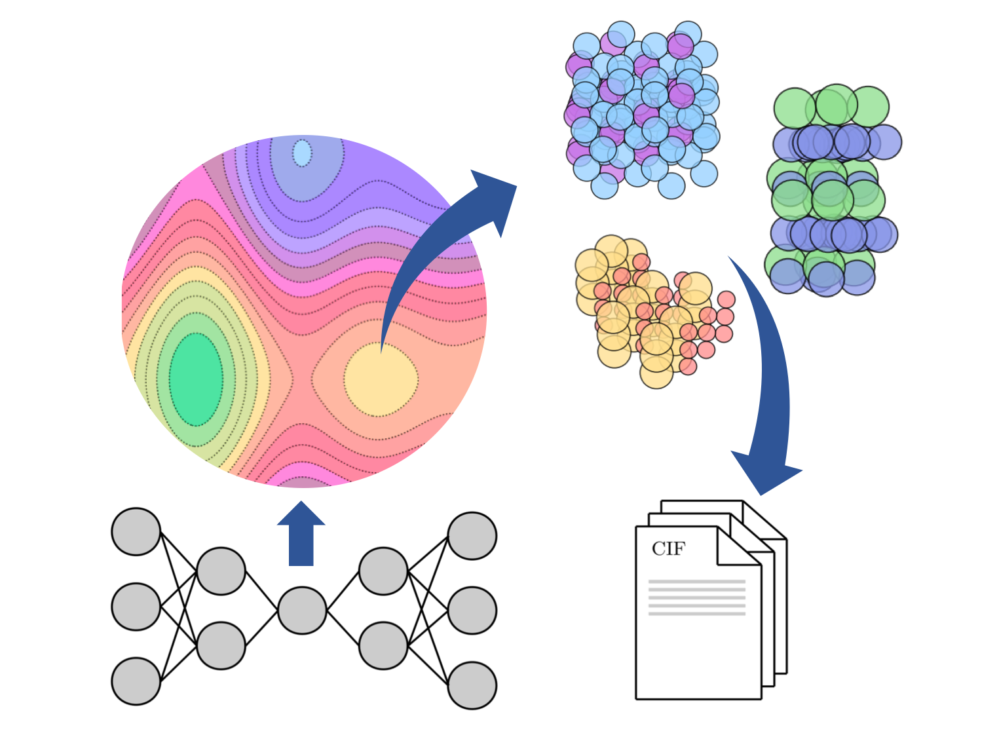
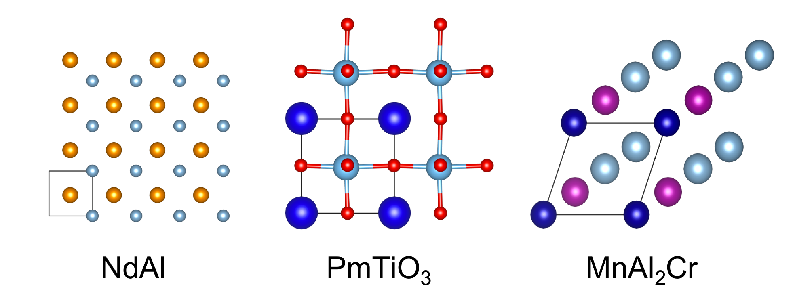
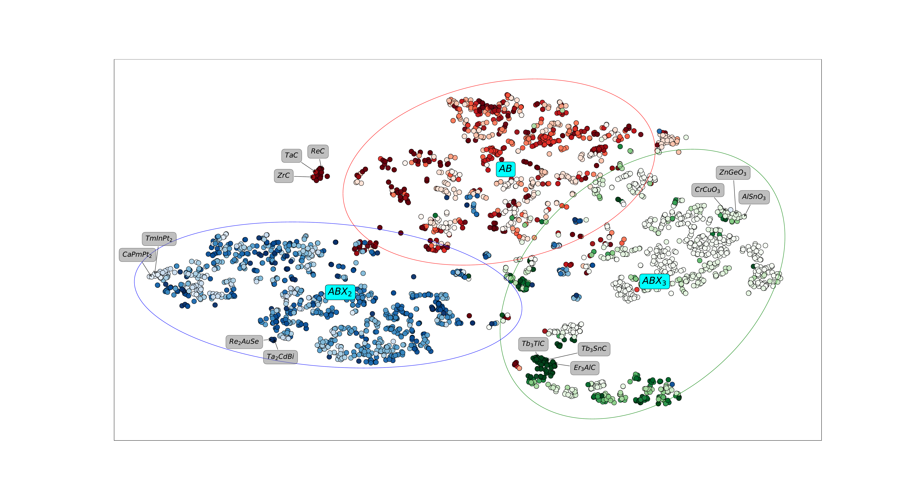
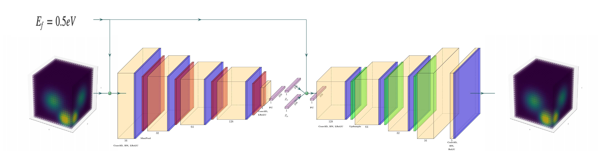
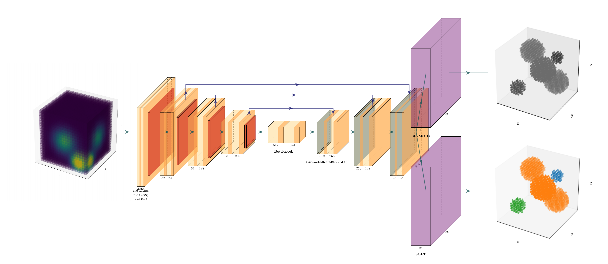
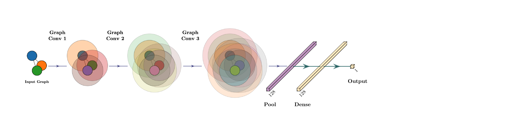
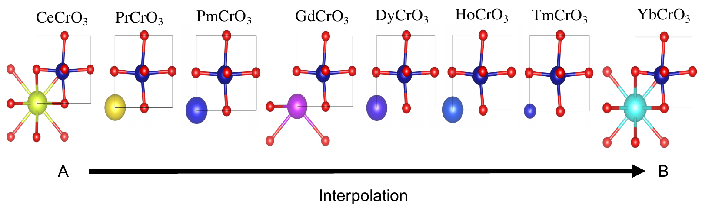

# Inorganic Crystal Structure Generation in 3D (ICSG3D)

<b>A deep learning pipeline for generation of 3D crystal structures and prediction of their properties</b>

----

<b>All source code and images are associated with the paper:  
C. J. Court, B. Yildirim, A. Jain, J. M. Cole, 
<i>"3-D Inorganic Crystal Structure Generation and Property Prediction via Representation Learning"</i>, 
J. Chem. Inf Model. (accepted for publication) (2020). <b> 
<a href="https://pubs.acs.org/doi/10.1021/acs.jcim.0c00464">Paper HTML</a>

----

# Examples of generated structures

# Representation learning of crystal structures

## Architecture

Our pipeline consists of 3 components.

1. A Conditional Deep Feature Consistent Variational Autoencoder
2. A UNet semantic segmentation network
3. A Crystal Graph Neural Network

### VAE

Encoder: 4x 3D convolutions, BatchNorm, ReLU and Maxpooling

Bottleneck: 3D convolution, LeakyReLU, Dense (256), 2x Dense (256) (\mu and \sigma)

Decoder: 4x 3D convolutions, BatchNorm, ReLU and upsampling

### UNET

Downward: 4 x 2 x 3D convolutions, ReLU, BatchNorm, and pooling

Bottleneck: 2 x 3D convolutions, ReLU BatchNorm

Upward: 4 x 2 x 3D convolutions, ReLU, BatchNorm and UpSampling

### CGCNN

## Installation

1. Clone the git repository
    > git clone https://github.com/by256/icsg3d
2. Install requirements
    > python3 -m pip install -r requirements.txt

## Getting Data

The system works on crystallographic information files (CIFs) to train the deep learning pipeline. In theory these can be from any source, but by default we use the materialsproject API.

For example, to retrieve all CIFs for cubic perovskits (ABX3):
> python3 query_matproj.py --anonymous_formula="{'A': 1.0, 'B': 1.0, 'C':3.0}" --system=cubic --name=perovskites

This will create a data/perovskites folder containing the cifs and a csv with associated properties

## Creating the network inputs

The various network input matrices can be created by
> mpiexec -n 4 python3 create_matrices.py --name=perovskites

## Train the UNET

Trai the unet for as many epochs as needed
> python3 train_unet.py --name perovskites --samples 10000 --epochs 50

## Train the VAE

Make sure you train the VAE second (as it uses the unet as a DFC perceptual model)
> python3 train_vae.py --name perovskites --nsamples 1000 --epochs 250

## View some results

1. Interpolations in vae latent space
    > python3 interpolate.py --name perovskites
2. Whole pipeline plots
    > python3 view_results.py --name perovskites
3. Evaluate coordinates and lattice params
    > python3 eval.py --name perovskites

## Generate new samples

Attempt to generate 1000 new samples arund a base compound CeCrO3 with variance 0.5
> python3 generate.py --name perovskites --nsamples 1000 --base CeCrO3 --var 0.5

This will create a new directory where you will find Cifs, density matrices, species matrices and properties for all generated compounds.

## Citation
C. J. Court, B. Yildirim, A. Jain, J. M. Cole, "3-D Inorganic Crystal Structure Generation and Property Prediction via Representation Learning", *J. Chem. Inf. Model.* 2020 (accepted for publication).

## Funding Statement
This project was financially supported by the Engineering and Physical Sciences Research Council (EPSRC, EP/L015552/1), Science and Technology 
Facilities Council (STFC) and the Royal Academy of Engineering 
(RCSRF1819\7\10).
